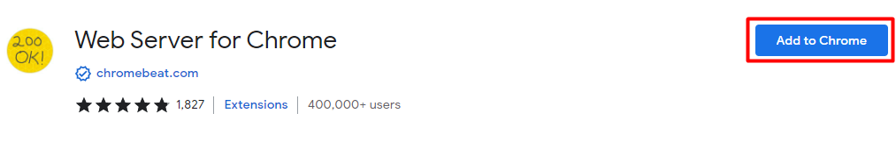
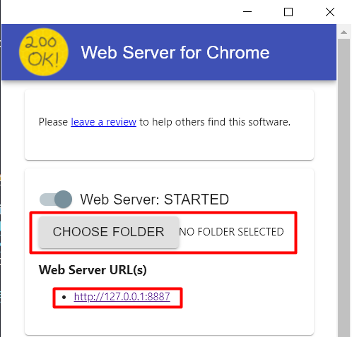

# vem-pra-zumpy
Repositório para avaliação técnica de candidatos

## 📁 Instalação	

1 - Para instalar, primeiramente baixe o repositório através do comando:

```
https://github.com/eoisaac/vem-pra-zumpy.git
```
2 - Após o download do repositório, instale a extensão [Web Server](https://chrome.google.com/webstore/detail/web-server-for-chrome/ofhbbkphhbklhfoeikjpcbhemlocgigb/related?hl=en) para o Google Chrome;



3 - Execute a extensão, selecione o local onde o repositório foi baixado e em seguida clique na URL.
